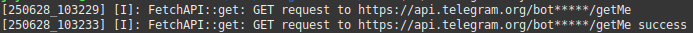

# TesserGram

**TesserGram** is a lightweight and modular C++ library for building Telegram bots. This library designed with simplicity and portability in mind, it only relies on standard libraries such as `pthread` and `libcurl`. TesserGram is ideal for developers looking to implement bot functionality in C++ with minimal external dependencies and minimal device resource.

---

## 🚀 Features

### 1 Secure on debuging

- Hide your telegram bot token on debuging



### 2. Basic Bot Functionality
- Receive updates using `getUpdates`
- Send text messages via `apiSendMessage`

```c++
...
...
telegram.getUpdates(
    [](Telegram &t, const NodeMessage &message)
    {
        message.display();
        message
            .processMessage(
                [&](const Message &m)
                {
                    t.apiSendMessage(m.chat.id, "Hi...");
                })
            .processCallbackQuery(
                [&](const CallbackQuery &c)
                {
                    t.apiSendMessage(c.message->chat.id, "Hello...");
                });
    });
...
...
```

---

### 3. Send Chat Actions
Support for `sendChatAction` to display user activity:
- Typing (`typing`)
- Uploading photo (`upload_photo`)
- Recording voice, etc.

```c++
...
...
telegram.getUpdates(
    [](Telegram &t, const NodeMessage &message)
    {
        message.display();
        message
            .processMessage(
                [&](const Message &m)
                {
                    t.apiSendChatAction(m.room.id, Chat::Action::TYPING); // send typing action while create an reply
                    t.apiSendMessage(m.chat.id, "Hi...");
                });
    });
...
...
```


---

### 4. Webhook Integration
Webhook support as an alternative to polling, for real-time updates.

```c++
...
...
/* Sets the callback function to be executed when a new message is received */
telegram.setWebhookCallback(
    [this](Telegram &telegram, const NodeMessage &message)
    {
        message.display();
        message
            .processMessage(
                [&](const Message &m)
                {
                    t.apiSendMessage(m.chat.id, "Hi...");
                })
            .processCallbackQuery(
                [&](const CallbackQuery &c)
                {
                    t.apiSendMessage(c.message->chat.id, "Hello...");
                });
    });
/* Defines the webhook URL where Telegram will send incoming update messages */
telegram.apiSetWebhook(url);
/* Starts the webhook server to listen for incoming connections from Telegram */
telegram.servWebhook();
...
...
```

---

### 5. Send Media
Send various types of media:
- **Photos** via `sendPhoto`
- **Documents** via `sendDocument`
- **Audio files** via `sendAudio`
- **Voice notes** via `sendVoice`
- **Videos** via `sendVideo`

```c++
...
...
telegram.apiSendDocument(<chat_room>, "Read this document!", <document_file>);
telegram.apiSendPhoto(<chat_room>, "This the picture!", <picture_file>);
telegram.apiSendAnimation(<chat_room>, "This the animation!", <gif_file>);
telegram.apiSendVideo(<chat_room>, "This the video!", <video_file>);
telegram.apiSendVoice(<chat_room>, "This the voice notes!", <audio_file>);
telegram.apiSendAudio(<chat_room>, "This the audio!", <audio_file>);
...
...
```


---

### 6. Custom Keyboard
Send reply keyboards for interactive user input using `sendKeyboard`.

```c++
...
...
TKeyboard keyboard(TKeyboard::Type::KEYBOARD, "Test Keyboard!");
keyboard
    .add("[ \"Key-1\", \"Key-2\" ]")
    .add("[ \"Key-3\" ]")
    .add("[ \"Key-4\" ]");
telegram.apiSendKeyboard(<chat_room>, keyboard);
...
...
```


---

### 7. Inline Keyboard
Send inline buttons with callbacks or URLs using `sendInlineKeyboard`.

```c++
...
...
TKeyboard keyboard(TKeyboard::Type::INLINE_KEYBOARD, "Test Keyboard!");

std::vector<TKeyboard::TKeyButton> buttons;
buttons.push_back(TKeyboard::TKeyButton(TKeyboard::TKeyButton::Type::CALLBACK_QUERY, "No!", "no"));
buttons.push_back(TKeyboard::TKeyButton(TKeyboard::TKeyButton::Type::CALLBACK_QUERY, "Yes!", "yes"));

keyboard
    .add(TKeyboard::TKeyButton::Type::URL, "Google", "www.google.com")
    .add(buttons);

telegram.apiSendKeyboard(<chat_room>, keyboard);
...
...
```


---

### 8. Minimal Dependencies
Only requires:
- `pthread`
- `libcurl`

✅ No need for heavy third-party frameworks — simple to build and integrate into most C++ projects.

---

## 🛠️ Build Library and Examples

Ensure you have `g++`, `libcurl`, and `pthread` installed.

```bash
git clone https://github.com/JayaWikrama/TesserGram.git
git submodule update --init --recursive

cd TesserGram
mkdir build
cd build
cmake ..
make
```

## ⚙️ Using the Library

One way to use this library is by integrating it into your main application as a Git submodule. Here’s an example of how to create a new project and integrate the TesserGram library into it:

1. Create the project tree.

```bash
mkdir YourProject
cd YourProject
mkdir src
mkdir include
mkdir external
git init .
```

2. Add the TesserGram library as an external library.

```bash
git submodule add https://github.com/JayaWikrama/TesserGram.git external/TesserGram
git submodule update --init --recursive
```

3. Create the main application source code.

```bash
nano src/main.cpp
```

Here is the sample source code.

```cpp
#include <iostream>
#include <string>
#include "telegram.hpp"

std::string token = "your_token";

int main(int argc, char **argv){
    Telegram telegram(token);
    if (telegram.apiGetMe()){
        telegram.info();
    }
    else {
        debug.log(Debug::ERROR, __PRETTY_FUNCTION__, "Failed to access telegram!\n");
    }
    return 0;
}
```

Save file by press `[Ctrl + o]` on your keyboard and then press `[Enter]`. After that press `[Ctrl + x]`.

4. Create a `CMakeLists.txt` file.

```bash
nano CMakeLists.txt
```

Here is `cmake` configuration:

```bash
cmake_minimum_required(VERSION 3.0.0)
set(PROJECT_VERSION_MAJOR "1")
set(PROJECT_VERSION_MINOR "1")
set(PROJECT_VERSION_PATCH "0")
project(tgram VERSION 1.1.0 LANGUAGES CXX)

include(FindPkgConfig)

# Set the default build type to Release if not specified
if(NOT CMAKE_BUILD_TYPE)
  set(CMAKE_BUILD_TYPE Release)
endif()

# Find and Check Library
find_package(PkgConfig REQUIRED)

# Specify the source files
set(SOURCE_FILES
    src/main.cpp
)

# Create the executable
add_executable(${PROJECT_NAME} ${SOURCE_FILES})

# Include directories
target_include_directories(${PROJECT_NAME} PUBLIC
  $<BUILD_INTERFACE:${CMAKE_CURRENT_SOURCE_DIR}/include>
  $<BUILD_INTERFACE:${CMAKE_CURRENT_SOURCE_DIR}/src>
  $<BUILD_INTERFACE:${CMAKE_CURRENT_SOURCE_DIR}/external/TesserGram/include>
  $<INSTALL_INTERFACE:include>
)

# Ensure TesserGram is built before the executable
add_dependencies(${PROJECT_NAME} tessergram-lib)

# Link the executable with the library
target_link_libraries(${PROJECT_NAME} PRIVATE tessergram-lib)
target_link_libraries(${PROJECT_NAME} PUBLIC -lpthread -lcurl)

add_subdirectory(external/TesserGram EXCLUDE_FROM_ALL)

# Set compiler and linker flags
set(CMAKE_CXX_FLAGS_DEBUG "${CMAKE_CXX_FLAGS_DEBUG} -g -O0")
set(CMAKE_EXE_LINKER_FLAGS_DEBUG "${CMAKE_EXE_LINKER_FLAGS_DEBUG} -g -O0")
set(CMAKE_CXX_FLAGS_RELEASE "${CMAKE_CXX_FLAGS_RELEASE} -O3")
set(CMAKE_EXE_LINKER_FLAGS_RELEASE "${CMAKE_EXE_LINKER_FLAGS_RELEASE} -O3")
set(CMAKE_USE_RELATIVE_PATHS OFF)
```

Save file by press `[Ctrl + o]` on your keyboard and then press `[Enter]`. After that press `[Ctrl + x]`.

### Explanation

- The `$<BUILD_INTERFACE:${CMAKE_CURRENT_SOURCE_DIR}/external/TesserGram/include>` command adds a reference to the header file location of the TesserGram Library. This ensures that during the build process, CMake can locate the TesserGram headers correctly.

- The `add_dependencies(${PROJECT_NAME} tessergram-lib)` command specifies that the TesserGram Library must be built before the main application. This ensures that the TesserGram Library is compiled before the main project depends on it.

- The `target_link_libraries(${PROJECT_NAME} PRIVATE tessergram-lib)` command links the TesserGram Library to the main application as private libraries. This means that these libraries are used internally by the main project.

- The `add_subdirectory(external/TesserGram EXCLUDE_FROM_ALL)` command adds the external/TesserGram directory as part of the main project. The EXCLUDE_FROM_ALL option prevents CMake from building this subdirectory by default unless explicitly requested.

5. Build the project.

```bash
mkdir build
cd build
cmake ..
make
```

6. Run the application.

```bash
./tgram
```
